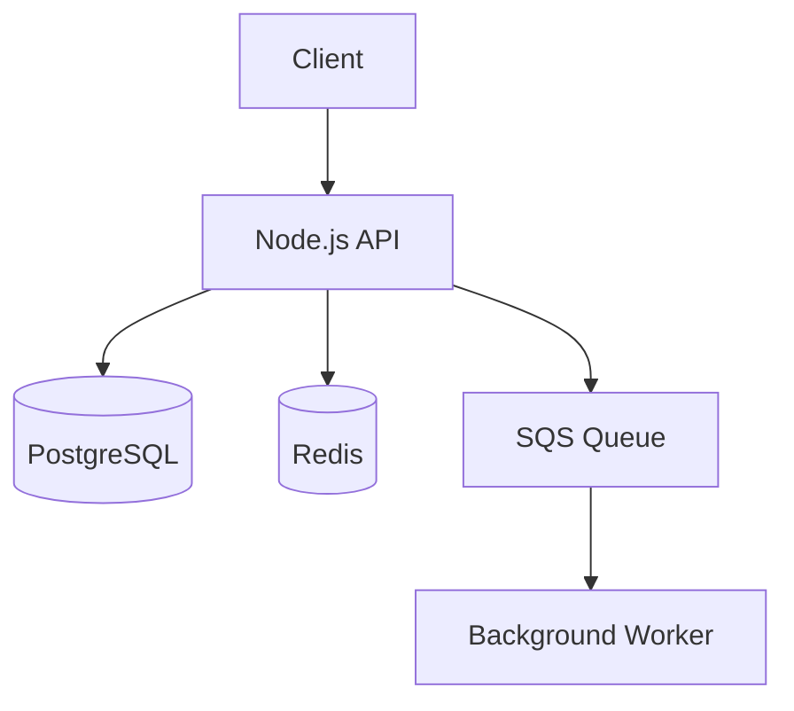

You are a senior software architect performing reverse engineering analysis on a legacy codebase.

## Task: Infrastructure and Architecture Detection

Analyze the provided raw ingestion data and reconstruct the infrastructure architecture and data storage strategy of the system. Identify compute, storage, messaging, and deployment characteristics.

## Input: {{CONTEXT}}

{{CONTEXT_SOURCES}}

The context above contains raw Markdown files from the ingest phase, including:
- `raw/repo/dependencies.md` — package dependencies revealing infrastructure choices
- `raw/repo/env-vars.md` — environment variables revealing external services and config
- `raw/repo/structure.md` — directory tree indicating project layout and deployment units

## Output Format

Produce the following sections:

### Architecture Overview
High-level architecture description with a Mermaid diagram showing major components and their relationships.

### Compute
Runtime environment, framework, and any serverless or containerization signals (e.g., Dockerfile, Lambda handlers).

### Data Storage
For each storage system: type (relational DB, cache, object store, search index), technology, purpose, and connection method.

### Messaging and Queues
Any message brokers, job queues, or event buses detected. Include technology, topics/queues found, and producers/consumers.

### External Services
Third-party services used for email, payments, auth, analytics, etc. Infer from env var names and dependency names.

### Deployment Signals
CI/CD hints, cloud provider clues, environment names (staging, production), and configuration management patterns.

## Confidence

At the end, rate your overall confidence as one of: HIGH / MEDIUM / LOW

Explain briefly what drove the rating (e.g., "explicit Docker Compose and .env files" → HIGH, "minimal env vars, no infra config found" → LOW).

## Example Output

### Architecture Overview

### Compute

- Runtime: Node.js 20, Express 4.x
- Containerised via Dockerfile (multi-stage)
- Worker process separate from API (same repo, different entrypoint)

### Data Storage

| Type | Technology | Purpose | Connection |
|---|---|---|---|
| Relational DB | PostgreSQL 15 | Primary data store | DATABASE_URL env var |
| Cache | Redis 7 | Session + rate limiting | REDIS_URL env var |

### Messaging and Queues

- AWS SQS: `orders-fulfillment-queue` — producer: OrderService, consumer: FulfillmentWorker

### External Services

- Stripe (STRIPE_SECRET_KEY) — payments
- SendGrid (SENDGRID_API_KEY) — email delivery

### Deployment Signals

- GitHub Actions CI (`.github/workflows/`)
- AWS (inferred from SQS + S3 env vars)
- Environments: `staging`, `production`

**Confidence: HIGH** — Dockerfile, docker-compose.yml, and explicit env vars provided clear infrastructure picture.
